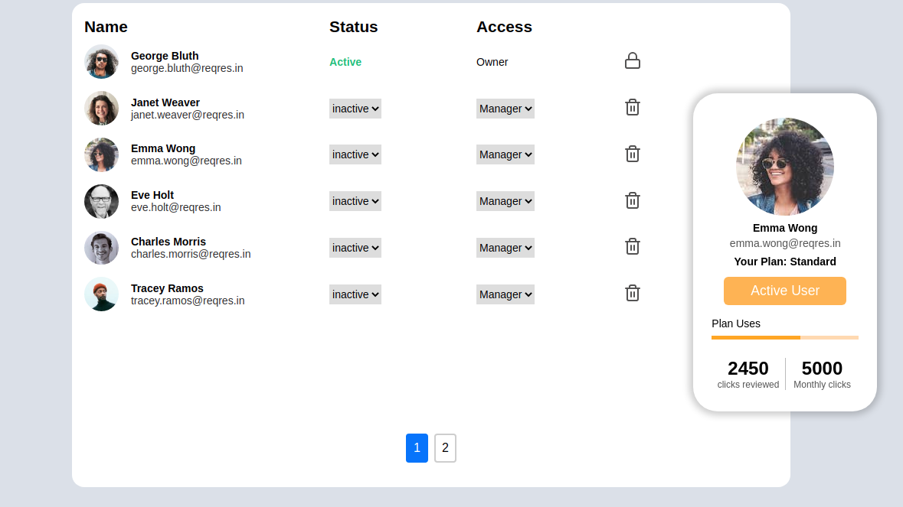
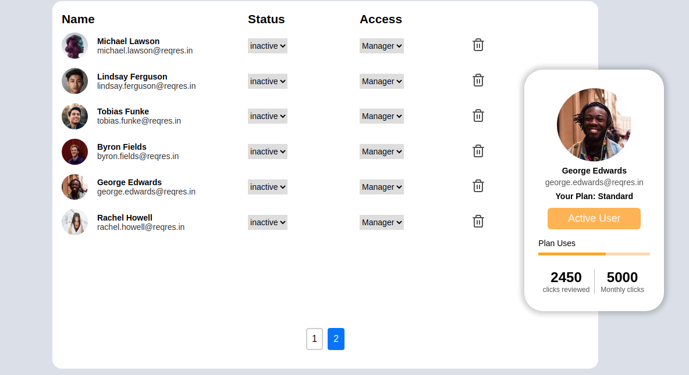

# react-practical-7

## user list app 
### hosted on netlify: https://semolina.netlify.app/
### hosed on heroku: https://semolina.herokuapp.com/
## Getting Started

1. Setup React

2. Clone the repo</br>

```sh
  git clone https://github.com/smeekas/react-practical7/
```

3. change directory</br>

```sh
  cd ./react-practical7
```

4. Install dependency</br>

```sh
  npm install
```

5. Run the app</br>

```sh
  npm start
```

6. Production build</br>

```sh
  npm run build
```

## App preview

